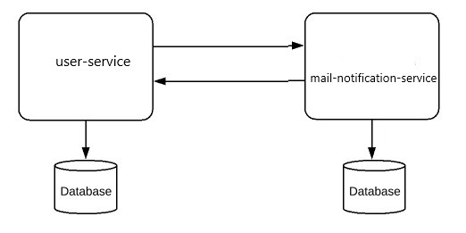

# UserNotificationKafkaMicroApplication

# SpringBoot -- Microservices -- kafka -- Docker
## I have used Choreography Saga Pattern to develop this microservices application

This application has 2 service, one for UserService and another for MailNotificationService

### Functionality:
I have developed 3 REST API, one for user registration, another one is user's mail list, and third one is Allmail list API for this solution.

	1. Create user account:
		• Accept the user details: username, password and email.
		• All fields are required and the password must be at least 10 characters long, no other validation is needed.
		• Store the details in the User service.
		• Trigger an event that will be caught by the Mail notification service.
		• The Mail notification service will need to check the user’s email:
			o If the user’s email ends in “@gmail.com”, we don’t allow the registration. Use the Saga pattern to handle this case in the User service.
			o If the user’s email ends in anything else, store the user’s email and user ID. Then add them to the mail list “Default mail list”.
			
	2. Get user’s mail lists:
		• The request contains the user’s id.
		• An array of strings (the mail lists that contain the user) returns.
		• If the user is connected to no list, return empty body with 404 HTTP status 
    
  	3. Get All Mail list:
    		• All data will retrun in Arraylist from the default mail list table.
    
### I have used the following Java Stacks - 
## Tech Stacks:
  • Java 8  
  • Spring Boot  
  • MySQL 8  
  • Kafka   
  • Docker  
  • Choreography Saga Pattern  
  • Flyway Schema migration   
  • JUnit 5   
  
## Getting Started
To Deploy this application, run the following commands:

# First to run your kafka server
docker-compose up -d

# Stop your kafka server
docker-compose rm -fsv

## installs the resulting artifact (JAR) by the folloing command
# install jar for user-service
cd UserService
mvn clean install

# install jar for mail-notification-service
cd MailNotificationService
mvn clean install

### Deploy and intall the microservices jar into docker container or you can use spring-boot run command
# Execute the docker build command
DOCKER_SCAN_SUGGEST=false docker build -t user_mail_microservices_kafka_app .
# Execute the docker run command
docker run user_mail_microservices_kafka_app  
after command please wait for spring-boot both services will run.

### OR you can use spring-boot run command( if you don't want to doploy in docker container)
# install and run jar for user-service
cd UserService  
mvn clean install  
mvn spring-boot:run  

# install and run jar for mail-notification-service
cd MailNotificationService  
mvn clean install  
mvn spring-boot:run  

### REST API Endpoint 
## Please dowonload the postman collection from [MicroservicesKafkaAPI.postman_collection.json] file from the repository to run the below API
# Create new user API

URL: http://localhost:8082/api/v1/user_registration  
Method: POST   
Content-Type: application/json   
Request Body:  
  {
    "username":"dewamomen",
    "password":"zayan@1234",
    "email":"zayandewan@gmail2.com"
 }
 
 Response Body:  
 {
    "userid": 3,
    "username": "dewamomen",
    "password": "zayan@1234",
    "email": "zayandewan@gmail2.com",
    "userRegistrationStatus": "CREATED",
    "defaultMailListStatus": null
 }
 
# Get user mail list API

URL: http://localhost:8083/api/v1/users_mail_list/1  
Method: GET  
Content-Type: application/json   
 
Response Body:  
{
    "id": 1,
    "userid": 1,
    "email": "zayandewan@gmail1.com"
}
 
 # Get All user mail list API

URL: http://localhost:8083/api/v1/getAllMailList  
Method: GET  
Content-Type: application/json  
 
Response Body:  
[
    {
        "id": 1,
        "userid": 1,
        "email": "zayandewan@gmail1.com"
    },
    {
        "id": 2,
        "userid": 3,
        "email": "zayandewan@gmail2.com"
    }
]
